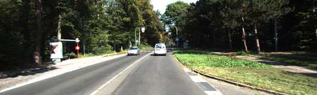
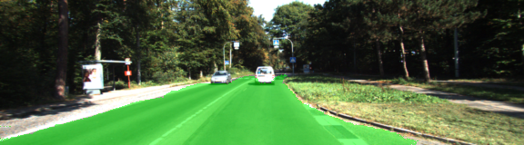
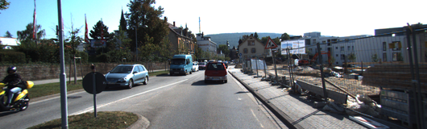
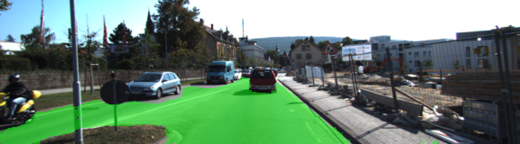
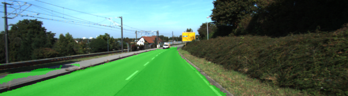

# Semantic Segmentation

### Model
In this project, I have labeled the pixels of a road in images using a Fully Convolutional Network (FCN).
To do this, I used VGG16 as an encoder, then 1x1 convolutions which replace the fully connected layers in the original
VGG16 model, followed by a decoder, consisting of series of transposed convolutions and skip connections. The idea is 
that after the image goes through the encoder, a vector representing its semantics will be created and then this vector 
will be decoded into an image again from the decoder. The architecture for the decoder can be found in the `layers` method
in `main.py`. L2 regularization has been used in the decoder to avoid overfitting.

#### Hyperparameters
* Learning rate: 1e-4
* Dropout with keep probability: 0.5
* Epochs: 20

#### Training 
The training was done on a `p2.xlarge` instance in AWS and took ~30 minutes to train. Full logs from the training are 
available in the file `train.log`. The loss function is `1.01993` in the beginning and it steadily goes down until it 
reaches `0.019856` after 20 epochs.

#### Example images

Original            |  Semantic segmentation
:-------------------------:|:-------------------------:
  |  
  |  
  |  
  |  

### Setup
##### Frameworks and Packages
Make sure you have the following is installed:
 - [Python 3](https://www.python.org/)
 - [TensorFlow](https://www.tensorflow.org/)
 - [NumPy](http://www.numpy.org/)
 - [SciPy](https://www.scipy.org/)
##### Dataset
Download the [Kitti Road dataset](http://www.cvlibs.net/datasets/kitti/eval_road.php) from [here](http://www.cvlibs.net/download.php?file=data_road.zip).  Extract the dataset in the `data` folder.  This will create the folder `data_road` with all the training a test images.

### Start
##### Implement
Implement the code in the `main.py` module indicated by the "TODO" comments.
The comments indicated with "OPTIONAL" tag are not required to complete.
##### Run
Run the following command to run the project:
```
python main.py
```
**Note** If running this in Jupyter Notebook system messages, such as those regarding test status, may appear in the terminal rather than the notebook.

### Submission
1. Ensure you've passed all the unit tests.
2. Ensure you pass all points on [the rubric](https://review.udacity.com/#!/rubrics/989/view).
3. Submit the following in a zip file.
 - `helper.py`
 - `main.py`
 - `project_tests.py`
 - Newest inference images from `runs` folder  (**all images from the most recent run**)
 
 ## How to write a README
A well written README file can enhance your project and portfolio.  Develop your abilities to create professional README files by completing [this free course](https://www.udacity.com/course/writing-readmes--ud777).
